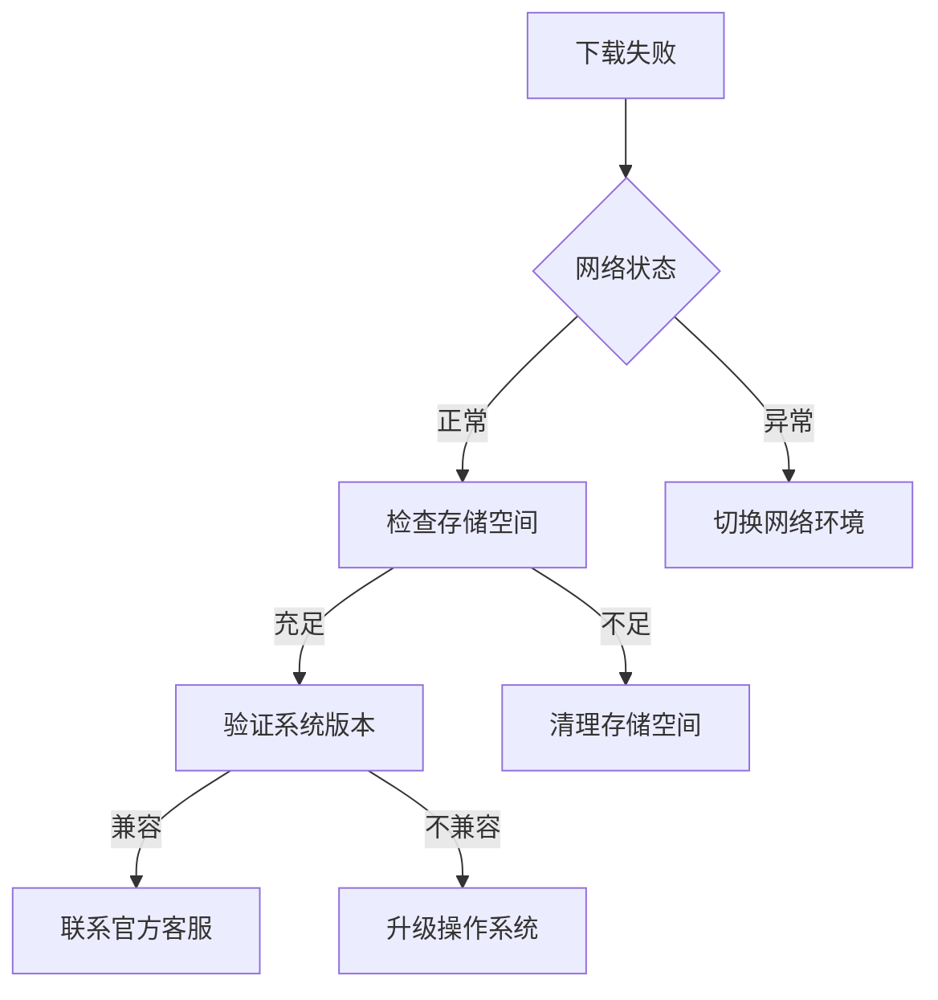

# 下载OKX交易所App遇困难？这些原因及解决方法快来看

## 一、常见下载障碍分析

在尝试下载OKX交易所App时，用户常会遇到以下几类典型问题：

### 1. 网络连接异常
- **信号波动**：Wi-Fi信号弱或移动数据不稳定可能导致下载中断
- **DNS解析问题**：服务器连接异常时会出现「无法连接到服务器」提示
- **网络协议限制**：部分企业/校园网络会屏蔽应用下载功能

### 2. 存储空间不足
- 系统提示「存储空间不足」时，实际可用空间可能低于安装包体积
- 安卓用户需注意内部存储与SD卡分区管理问题
- iOS系统需预留至少1.5倍安装包体积的可用空间

### 3. 系统兼容性问题
| 操作系统版本 | 最低兼容要求 | 建议升级版本 |
|--------------|--------------|--------------|
| Android      | 8.0及以上    | 10.0以上     |
| iOS          | 12.0及以上   | 15.0以上     |

## 二、分级解决方案指南

### 1. 网络问题解决策略
👉 [获取稳定网络连接方案](https://bit.ly/okx_welcome)
- 切换网络环境：尝试在运营商网络与Wi-Fi间切换
- 清除DNS缓存：Windows用户运行`ipconfig /flushdns`，Mac用户使用`sudo killall -HUP mDNSResponder`
- 更换下载时段：避开早晚高峰时段（7-9点/18-20点）

### 2. 存储空间优化技巧
- **安卓用户**：
  1. 使用「设置-存储」清理缓存
  2. 卸载未使用应用（建议保留空间＞5GB）
  3. 启用「深度清理」功能
- **iOS用户**：
  1. 通过「设置-通用-iPhone存储」管理大体积应用
  2. 删除未使用相册原片（建议开启iCloud照片）
  3. 移除离线视频/音乐文件

### 3. 系统升级操作指南
- 安卓：进入「设置-关于手机-系统更新」
- iOS：进入「设置-通用-软件更新」
- 升级前建议：
  - 备份重要数据
  - 保持电量＞50%
  - 连接Wi-Fi网络

## 三、进阶解决方案

### 1. 官方渠道验证
👉 [访问OKX官方下载中心](https://bit.ly/okx_welcome)
- 检查应用数字签名：确保SHA-256证书指纹匹配官方公示信息
- 核对应用体积：与官网标示的安装包大小误差＜5MB
- 验证开发者信息：安卓显示「OKX Mobile Pte. Ltd.」，iOS显示「OKX Corporation」

### 2. 第三方市场选择标准
| 应用市场       | 安全评级 | 特色功能          |
|----------------|----------|-------------------|
| 华为应用市场   | ★★★★★   | 系统级权限管理    |
| 豌豆荚         | ★★★★☆   | 病毒查杀功能      |
| APKPure        | ★★★☆☆   | 多版本回溯        |

> ⚠️ 警示：不建议使用来源不明的APK安装包，可能携带恶意代码

### 3. 账户地域限制解决方案
- 更换Apple ID地区（需配合新地区支付方式）
- 使用官方海外节点加速器（需符合当地法规）
- 联系客服获取本地化下载方案

## 四、FAQ高频问题解答

**Q：下载进度卡在90%该如何处理？**  
A：建议尝试清除应用商店缓存：安卓用户进入「设置-应用管理-应用商店-存储」，iOS用户卸载重装App Store

**Q：系统提示「未受信任的企业级开发者」怎么办？**  
A：需手动开启信任设置：设置-通用-设备管理-选择对应证书-信任

**Q：旧版本手机能否继续使用？**  
A：OKX支持Android 8.0/iOS 12.0以上系统，但建议使用3年内发布的机型获得最佳体验

**Q：如何判断下载源是否安全？**  
A：可通过官方渠道核对MD5校验码，或使用Virustotal多引擎扫描安装包

## 五、故障排除流程图

## 六、长期使用建议

👉 [获取OKX最新版本更新通知](https://bit.ly/okx_welcome)
1. 开启应用内更新提醒功能
2. 关注官方社交媒体账号
3. 定期清理应用缓存（建议每月一次）
4. 使用专业设备管理工具（如「Device Care」）
