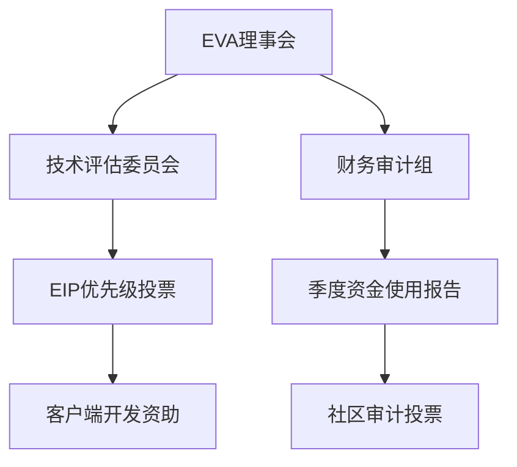

# 以太坊社区基金会设定ETH价格目标$10,000，推动生态发展

## ECF成立背景与核心使命
以太坊社区基金会（Ethereum Community Foundation，简称ECF）由核心开发者Zak Cole发起，旨在通过战略投资推动ETH价值增长。该组织成立的核心动因在于现有以太坊基金会对ETH资产属性的重视不足，ECF计划通过资助基础设施项目实现ETH价格突破$10,000的历史性目标。

👉 [获取加密货币市场最新动态](https://bit.ly/okx_welcome)

### 战略投资方向解析
ECF确立了四大核心投资领域：
1. **销毁机制增强**：支持EIP-1559等通缩模型优化
2. **公共物品建设**：资助去中心化存储、隐私计算等基础服务
3. **核心层升级**：投资共识层客户端开发及分片技术研究
4. **可扩展性突破**：推进Layer2解决方案与跨链互操作性

| 投资领域       | 典型项目示例         | 预期影响                |
|----------------|----------------------|-------------------------|
| 销毁机制       | EIP-1559改进提案     | 年销毁率提升至3-5%      |
| 公共物品       | IPFS集成开发         | 网络存储成本降低40%     |
| 核心层升级     | Prysm客户端优化      | 验证节点效率提升200%    |
| 可扩展性       | ZK-Rollups研发       | 交易处理量达10万TPS     |

## 资助项目筛选标准
ECF制定了严格的资金发放准则：
- 必须采用以太坊作为唯一结算层
- 禁止发行额外代币（反对Uniswap等模式）
- 采用不可变协议设计（反对协议费用变更）
- 开发团队需通过DAO治理认证

> "我们致力于消除利益冲突，确保每笔资助都直接增强ETH的货币属性。" —— Zak Cole

### 与传统基金会的差异对比
| 维度         | ECF标准               | 传统模式                 |
|--------------|-----------------------|--------------------------|
| 代币政策     | 纯ETH结算             | 允许项目发行治理代币     |
| 资金用途     | 100%公开透明          | 部分资金用于市场推广     |
| 开发激励     | 核心协议贡献奖励      | 侧重应用层项目扶持       |

## 首个资助对象EVA深度解读
以太坊验证者协会（EVA）作为首个受益者，将获得价值$250万的ETH资助。该组织将重点推进：
1. **货币政策改革**：建立ETH发行率动态调整模型
2. **客户端多样性**：资助Lighthouse、Nimbus等替代客户端
3. **验证者教育**：开展质押风险防控培训课程

👉 [探索专业级区块链投资方案](https://bit.ly/okx_welcome)

### EVA治理架构

## 争议与挑战应对
针对Offchain Labs（Arbitrum开发方）的潜在利益冲突，ECF采取以下措施：
- 要求Prysmatic Labs剥离客户端开发权
- 建立开发者利益申报制度
- 实施资助项目定期审计机制

### ETH价格驱动因素分析
| 影响因素       | 当前水平    | 目标提升幅度 |
|----------------|-------------|--------------|
| 通缩率         | 0.8%年化    | 提升至5%     |
| DApp数量       | 4,200+      | 目标10,000+  |
| 机构投资者占比 | 12%         | 提升至30%    |
| 平均Gas费      | $15/笔      | 降至$0.5     |

## 常见问题解答

### Q：ECF的资金来源是否安全可靠？
A：ECF初始资金来自匿名巨鲸捐赠的50,000 ETH（约$1.5亿），采用多签钱包管理，每笔支出需3/5签名确认。资金使用完全透明，可通过区块链浏览器实时追踪。

👉 [查看加密资产安全存储方案](https://bit.ly/okx_welcome)

### Q：如何避免重复传统基金会的治理问题？
A：ECF采用"逆向空投"机制：任何获得资助的项目必须将5%的治理权分配给ETH质押者。同时设立"叛变惩罚金库"，对违反协议的开发者最高可处以$100万罚款。

### Q：$10,000价格目标的实现路径？
A：分三阶段推进：
1. **基础设施建设期**（2024Q3-2025Q2）：销毁率提升至3%
2. **应用爆发期**（2025Q3-2026Q4）：DApp数量突破8,000
3. **机构接纳期**（2027-2028）：推出ETH现货ETF

## 未来展望
ECF计划在2024年底前完成：
- 建立去中心化开发者激励池
- 上线ETH价值捕获仪表盘
- 启动亚洲开发者孵化计划

该基金会的成立标志着以太坊生态治理进入新纪元，通过技术创新与社区赋权的双重驱动，或将重塑整个区块链行业的发展范式。